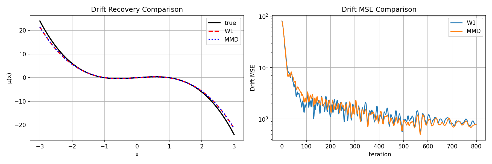
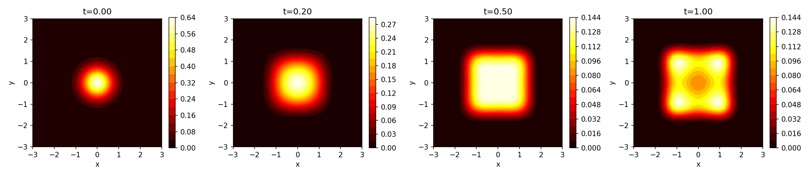
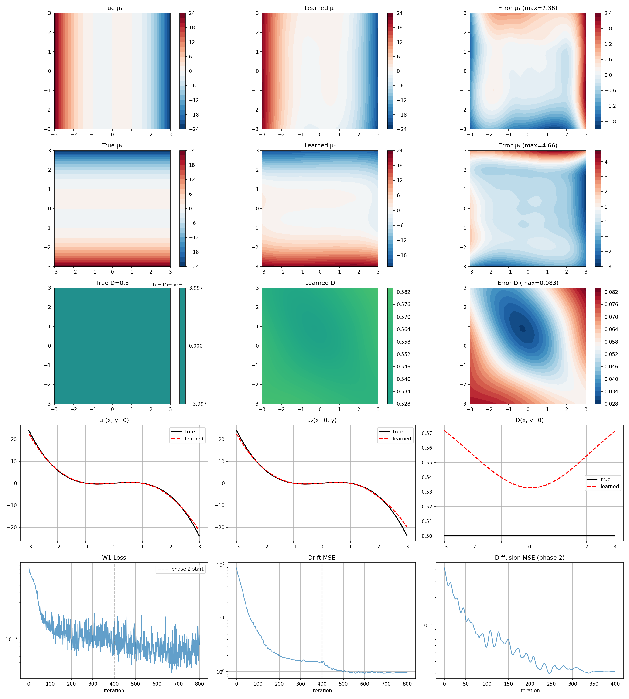

# Drift Recovery from Unlabeled Density Snapshots

Recovering unknown drift (and diffusion) in Fokker-Planck equations from **time-unlabeled** density snapshots via PDE-constrained optimization.

## Problem Setup

Consider the SDE

$$dX_t = \mu(X_t)\,dt + \sigma(X_t)\,dW_t$$

whose probability density $\rho(x,t)$ satisfies the Fokker-Planck equation (FPE):

$$\partial_t \rho = -\nabla\cdot(\mu\,\rho) + \nabla\cdot(D\,\nabla\rho), \quad D = \tfrac{1}{2}\sigma^2$$

with absorbing boundary conditions $\rho|_{\partial\Omega}=0$ and known initial density $\rho_0$.

**Observation model:** We observe $N$ density snapshots $\{\rho(\cdot, t_i)\}_{i=1}^N$ where $t_i \sim \text{Unif}(0,1)$, but the time labels $t_i$ are **unknown**. The goal is to recover $\mu$ (and optionally $D$) from these unordered snapshots.

**Optimization formulation:**

$$\min_{\mu} \; d\!\left(\nu_\rho^\mu,\; \nu_{\rho}^{\text{obs}}\right)$$

where $\nu_\rho^\mu$ is the pushforward of $\text{Unif}(0,1)$ through the map $t \mapsto \rho_\mu(\cdot,t)$, and $d$ is a distribution distance.

## Method

### Forward Solver

Crank-Nicolson scheme with precomputed step matrix $S = (I - \frac{\Delta t}{2}L)^{-1}(I + \frac{\Delta t}{2}L)$. Fully differentiable via PyTorch autograd. Time interpolation for arbitrary output times.

### Loss Function

**Pointwise 1D Wasserstein (W1):** At each spatial grid point $x_j$, the simulated and observed density values across samples form two 1D empirical distributions. Sort and match:

$$\mathcal{L}_{W1} = \frac{1}{|\Omega|}\sum_j W_1\!\left(\{\rho_\theta(x_j, \tau_i)\},\; \{\rho^{\text{obs}}_k(x_j)\}\right) = \frac{1}{|\Omega|}\sum_j \frac{1}{N}\sum_k |p_{(k)} - q_{(k)}|$$

This is preferred over MMD based on loss landscape analysis (smoother, faster convergence).

### Parameterization

| Level | Drift $\mu$ | Diffusion $D$ |
|-------|-------------|---------------|
| Polynomial | $\mu(x) = \theta_1 x + \theta_2 x^3$ | known constant |
| Neural network | cubic poly + residual MLP | linear poly + small MLP, softplus output |
| Joint inversion | poly + NN (two-phase training) | poly + NN (two-phase training) |

**Two-phase training** for joint inversion:
1. Phase 1: Train drift only with $D$ fixed at initial guess (not oracle)
2. Phase 2: Jointly fine-tune both with separate learning rates

## Experiments

### 1D Results

**Setup:** $\mu^*(x) = x - x^3$ (double well), $D=0.5$, $\Omega=[-3,3]$, $\rho_0 = \mathcal{N}(0, 0.25)$.

#### Loss Landscape: MMD vs W1

W1 landscape is smoother with clearer gradient toward the true parameters.


#### Double Well Evolution

Density evolves from unimodal Gaussian to bimodal under the double-well drift.


#### Neural Network Drift Recovery

Poly+NN architecture successfully recovers $\mu(x) = x - x^3$ in the data-supported region $|x| < 2$.



**Key 1D findings:**
- W1 converges faster and more accurately than MMD
- Poly+NN hybrid architecture avoids the $\mu\approx 0$ local minimum of pure NN
- Joint drift-diffusion recovery: increasing $N$ from 50 to 200 improves $D$ recovery by 7x
- Two-phase training is essential for joint inversion

### 2D Results

**Setup:** $\mu^*(x,y) = (x-x^3,\; y-y^3)$ (separable double well), $D=0.5$, $\Omega=[-3,3]^2$, $\rho_0 = \mathcal{N}(0, 0.25\cdot I)$.

#### Double Well Evolution

Density develops four modes at the potential minima $(\pm 1, \pm 1)$.



#### Polynomial Drift Inversion (20 parameters)

Complete cubic basis (10 monomials per component, 20 total). Sparse structure correctly identified: 16 zero coefficients recovered as $<0.02$, 4 nonzero coefficients recovered at ~80% magnitude.


#### Joint Drift + Diffusion Inversion (Poly+NN)

Two-phase training with $N=200$ observations. No oracle information used.

| | Drift MSE | Diffusion MSE |
|---|---|---|
| v1 (single phase, N=50) | 13.5 | 0.026 |
| **v2 (two-phase, N=200)** | **0.96** | **0.003** |



#### Spatially Varying Diffusion Recovery

True diffusion: $D(x,y) = 0.5 + 0.2\exp(-(x^2+y^2))$ (Gaussian bump). Two-phase training with $N=200$.

| | Drift MSE | Diffusion MSE |
|---|---|---|
| Constant $D=0.5$ | 0.96 | 0.003 |
| **Varying $D(x,y)$** | **1.15** | **0.0035** |

The method successfully recovers the spatial structure of the Gaussian bump in $D(x,y)$. Increasing $N$ to 500 further improves drift recovery (MSE 0.69) but reveals a drift-diffusion compensation effect where $D$ accuracy plateaus.


## Repository Structure

```
unlabel_pde/
├── README.md
├── figures/                        # Key result figures
├── 1D/
│   ├── fpe_solver.py               # 1D FPE solver (Crank-Nicolson)
│   ├── losses.py                   # MMD and pointwise W1 loss
│   ├── test_solver.py              # Solver tests (5 tests + benchmark)
│   ├── generate_data.py            # Observation data generation
│   ├── optimize.py                 # 2-parameter polynomial inversion
│   ├── nn_drift.py                 # Poly+NN drift inversion
│   └── joint_inversion.py          # Joint drift+diffusion inversion
└── 2D/
    ├── fpe_solver_2d.py            # 2D FPE solver (constant & variable D)
    ├── test_solver_2d.py           # 2D solver tests
    ├── optimize_2d_full_poly.py    # Complete cubic polynomial inversion
    ├── joint_2d_v2.py              # Joint inversion, constant D (two-phase)
    └── joint_2d_varD.py            # Joint inversion, spatially varying D
```

## Usage

```bash
# Run 1D solver tests
cd 1D && python test_solver.py

# Run 1D polynomial drift inversion
python optimize.py

# Run 1D joint inversion (poly+NN)
python joint_inversion.py

# Run 2D solver tests
cd ../2D && python test_solver_2d.py

# Run 2D polynomial drift inversion
python optimize_2d_full_poly.py

# Run 2D joint inversion (two-phase training)
python joint_2d_v2.py
```

## Dependencies

- Python 3.8+
- PyTorch (tested with 2.x)
- NumPy, Matplotlib
