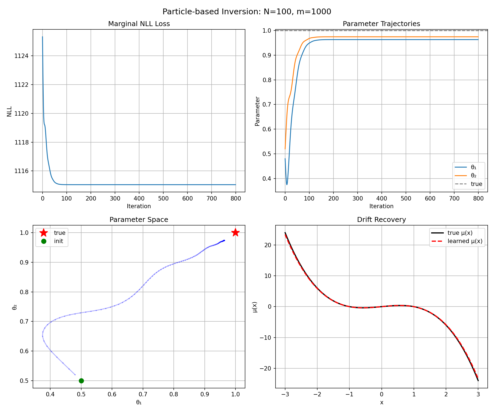
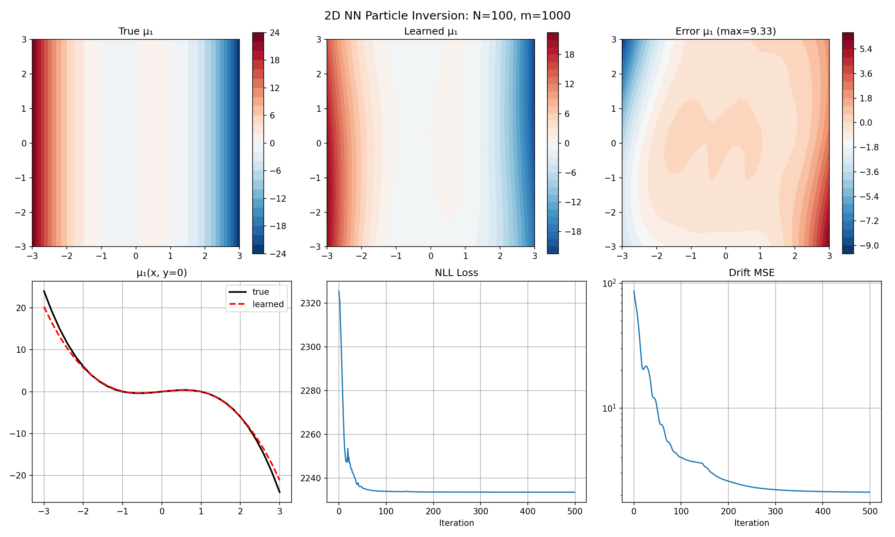
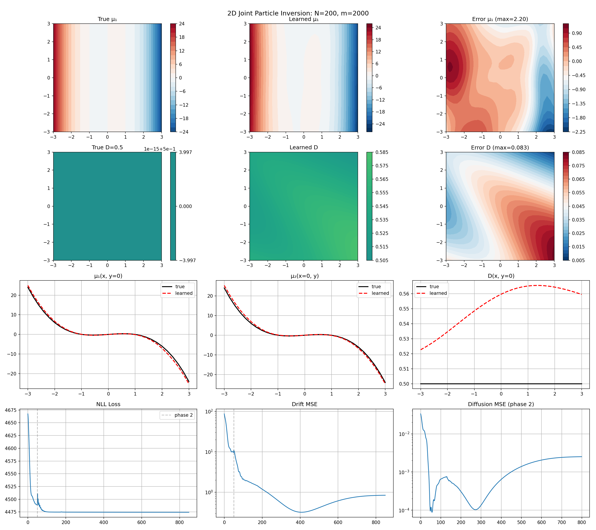

# Drift Recovery from Unlabeled Snapshots

Recovering unknown drift (and diffusion) in Fokker-Planck / SDE systems from **time-unlabeled observations** via PDE-constrained optimization.

We consider two observation settings:
1. **Density-based:** full density snapshots $\rho(\cdot, t_i)$ at unknown times
2. **Particle-based:** groups of i.i.d. particle samples from $\rho(\cdot, t_i)$ at unknown times

---

## Problem Setup

Consider the SDE:

$$dX_t = \mu(X_t)\,dt + \sigma(X_t)\,dW_t$$

whose probability density $\rho(x,t)$ satisfies the Fokker-Planck equation:

$$\partial_t \rho = -\nabla\cdot(\mu\,\rho) + \nabla\cdot(D\,\nabla\rho), \quad D = \tfrac{1}{2}\sigma^2$$

with absorbing BCs $\rho|_{\partial\Omega}=0$ and known initial density $\rho_0$.

**Goal:** Recover $\mu$ (and optionally $D$) from $N$ time-unlabeled observations, where $t_i \sim \text{Unif}(0,1)$ are **unknown**.

---

## Part I: Density-Based Observations

> Detailed documentation: [`density/README.md`](density/README.md)

### Observation Model

We observe $N$ density snapshots $\{\rho(\cdot, t_i)\}_{i=1}^N$ directly.

### Method

**Pointwise W1 loss:** Sort and match simulated vs observed density values at each spatial grid point.

$$\mathcal{L}_{W1} = \frac{1}{|\Omega|}\sum_j \frac{1}{N}\sum_k |p_{(k)} - q_{(k)}|$$

**Forward solver:** Crank-Nicolson with precomputed step matrix. Fully differentiable.

### Key Results

| Experiment | Drift MSE | D MSE | Setting |
|---|---|---|---|
| 1D polynomial (2 params) | ~0 | - | N=50, W1 loss |
| 1D poly+NN | 0.78 | - | N=50 |
| 1D joint inversion | - | 0.001 | N=200, two-phase |
| 2D polynomial (20 params) | sparse recovery | - | N=30 |
| 2D joint (constant D) | 0.96 | 0.003 | N=200, two-phase |
| 2D joint (varying D) | 1.15 | 0.0035 | N=200, two-phase |

**Key findings:**
- W1 converges faster and more accurately than MMD
- Poly+NN hybrid avoids $\mu \approx 0$ local minimum of pure NN
- Two-phase training essential for joint drift-diffusion inversion
- Increasing $N$ is the most effective way to improve $D$ recovery

| | | |
|---|---|---|
|  |  |  |

---

## Part II: Particle-Based Observations

> Detailed documentation: [`particle/README.md`](particle/README.md)

### Observation Model

Each observation is a group of $m$ particles sampled at an unknown time:

$$t_i \sim \text{Unif}(0,1), \quad X_{i,1},\dots,X_{i,m} \overset{\text{i.i.d.}}{\sim} \rho(\cdot,t_i)$$

### Method

**Marginal likelihood:** Treat $t_i$ as latent variables and integrate them out.

$$\mathcal{L}(\mu) = -\sum_{i=1}^N \operatorname{LSE}_n \left( \log w_n + \sum_{r=1}^m \log \rho_\mu(X_{i,r},t_n) \right)$$

### Key Results

| Experiment | Drift MSE | D MSE | Setting |
|---|---|---|---|
| 1D polynomial (2 params) | ~0.04 | - | N=100, m=1000 |
| 1D poly+NN | 0.93 | - | N=100, m=1000 |
| 1D joint inversion | 0.22 | 0.001 | N=100, m=1000, two-phase |
| 2D polynomial (20 params) | ~good | - | N=100, m=1000 |
| 2D NN drift | 2.11 | - | N=100, m=1000 |
| 2D joint (best iter) | **0.32** | **0.0001** | N=200, m=2000, two-phase |

**Key findings:**
- Particle count $m$ is critical: $m=1$ severely ill-posed, $m \geq 1000$ approaches density-based performance
- Short Phase 1 warmup + long Phase 2 joint training works best
- Drift-diffusion compensation effect: early stopping recommended for joint inversion

| | | |
|---|---|---|
|  |  |  |

---

## Comparison: Density vs Particle Observations

| | Density | Particle |
|---|---|---|
| **Information** | Full $\rho(x,t)$ | Empirical measure ($m$ samples) |
| **Loss** | Pointwise W1 | Marginal NLL (log-sum-exp) |
| **Forward model** | FPE solver | FPE solver + interpolation |
| **1D joint D MSE** | 0.001 | 0.001 |
| **2D joint D MSE** | 0.003 | 0.0001 (best iter) |
| **Scalability** | Grid-based (curse of dimensionality) | Particle-based (scales better) |

---

## Repository Structure

```
unlabel_pde/
├── README.md                       # This file
├── density/                        # Density-based methods
│   ├── README.md
│   ├── 1D/                         # 1D experiments
│   ├── 2D/                         # 2D experiments
│   └── figures/
├── particle/                       # Particle-based methods
│   ├── README.md
│   ├── problem_setup.md            # Detailed math formulation
│   ├── 1D/                         # 1D experiments
│   ├── 2D/                         # 2D experiments
│   └── figures/
└── LICENSE
```

## Usage

```bash
# Density-based: 1D polynomial inversion
cd density/1D && python optimize.py

# Density-based: 2D joint inversion
cd density/2D && python joint_2d_v2.py

# Particle-based: 1D polynomial inversion
cd particle/1D && python optimize_particle_1d.py

# Particle-based: 2D joint inversion
cd particle/2D && python particle_2d.py joint
```

## Dependencies

- Python 3.8+
- PyTorch (tested with 2.x)
- NumPy, Matplotlib
