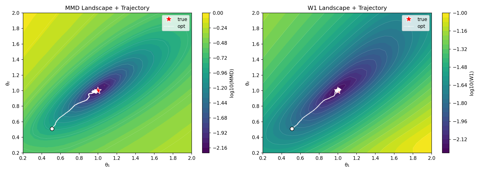
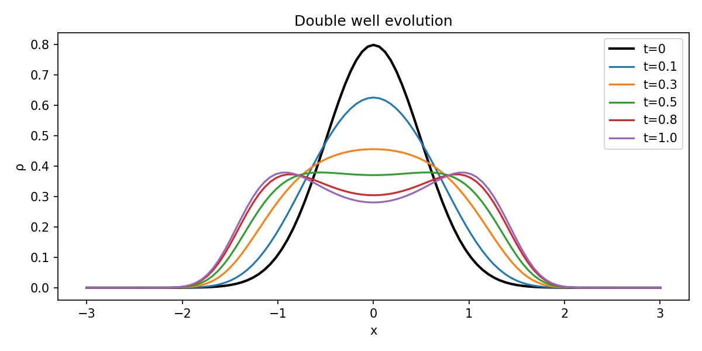
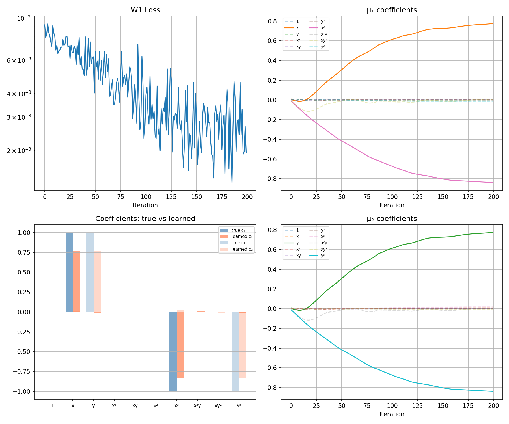
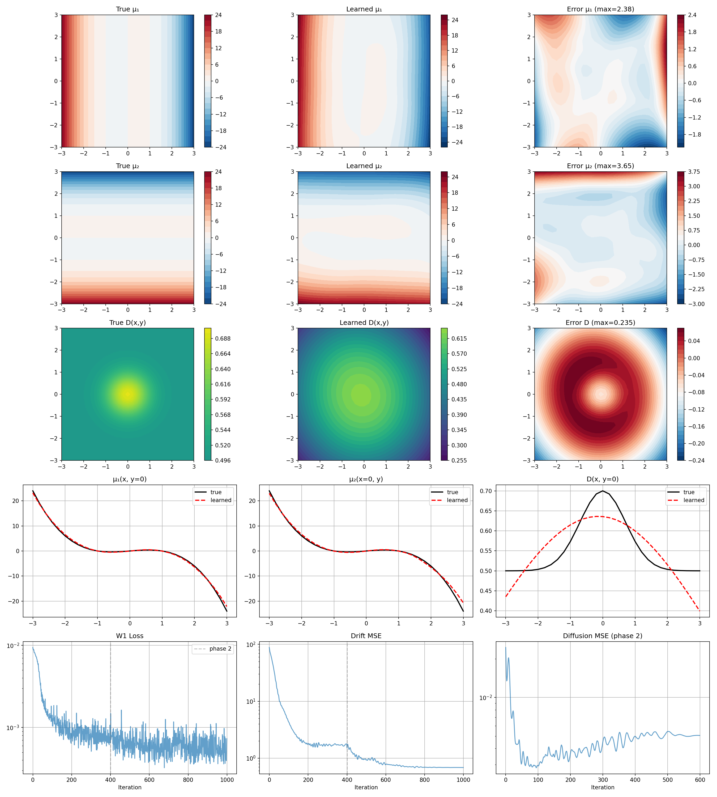

# Density-Based Drift Recovery

Recovering unknown drift (and diffusion) from **time-unlabeled density snapshots** via PDE-constrained optimization.

## Problem Setup

Consider the SDE:

$$dX_t = \mu(X_t)\,dt + \sigma(X_t)\,dW_t$$

whose density $\rho(x,t)$ satisfies the Fokker-Planck equation:

$$\partial_t \rho = -\nabla\cdot(\mu\,\rho) + \nabla\cdot(D\,\nabla\rho), \quad D = \tfrac{1}{2}\sigma^2$$

**Observation model:** We observe $N$ density snapshots $\{\rho(\cdot, t_i)\}_{i=1}^N$ where $t_i \sim \text{Unif}(0,1)$, but the time labels $t_i$ are **unknown**.

**Optimization:**

$$\min_{\mu} \; d\!\left(\nu_\rho^\mu,\; \nu_{\rho}^{\text{obs}}\right)$$

where $d$ is a distribution distance (pointwise W1 preferred over MMD).

## Method

### Forward Solver

Crank-Nicolson scheme with precomputed step matrix $S = (I - \frac{\Delta t}{2}L)^{-1}(I + \frac{\Delta t}{2}L)$. Fully differentiable via PyTorch autograd.

### Loss Function

**Pointwise 1D Wasserstein (W1):** Sort and match density values at each spatial grid point:

$$\mathcal{L}_{W1} = \frac{1}{|\Omega|}\sum_j \frac{1}{N}\sum_k |p_{(k)} - q_{(k)}|$$

### Parameterization

| Level | Drift $\mu$ | Diffusion $D$ |
|-------|-------------|---------------|
| Polynomial | $\mu(x) = \theta_1 x + \theta_2 x^3$ | known constant |
| Neural network | cubic poly + residual MLP | linear poly + small MLP, softplus output |
| Joint inversion | poly + NN (two-phase training) | poly + NN (two-phase training) |

## Results

### 1D

**Setup:** $\mu^*(x) = x - x^3$ (double well), $D=0.5$, $\Omega=[-3,3]$, $\rho_0 = \mathcal{N}(0, 0.25)$.

#### Loss Landscape: MMD vs W1

W1 landscape is smoother with clearer gradient toward the true parameters.



#### Double Well Evolution



#### Neural Network Drift Recovery

Poly+NN architecture successfully recovers $\mu(x) = x - x^3$ in the data-supported region $|x| < 2$.


**Key 1D findings:**
- W1 converges faster and more accurately than MMD
- Poly+NN hybrid architecture avoids the $\mu\approx 0$ local minimum of pure NN
- Joint drift-diffusion recovery: increasing $N$ from 50 to 200 improves $D$ recovery by 7x
- Two-phase training is essential for joint inversion

### 2D

**Setup:** $\mu^*(x,y) = (x-x^3,\; y-y^3)$, $D=0.5$, $\Omega=[-3,3]^2$, $\rho_0 = \mathcal{N}(0, 0.25 I)$.

#### Double Well Evolution


#### Polynomial Drift Inversion (20 parameters)

Complete cubic basis (10 monomials per component). Sparse structure correctly identified.



#### Joint Drift + Diffusion Inversion

| | Drift MSE | Diffusion MSE |
|---|---|---|
| v1 (single phase, N=50) | 13.5 | 0.026 |
| **v2 (two-phase, N=200)** | **0.96** | **0.003** |


#### Spatially Varying Diffusion

True: $D(x,y) = 0.5 + 0.2\exp(-(x^2+y^2))$.

| | Drift MSE | Diffusion MSE |
|---|---|---|
| Constant $D=0.5$ | 0.96 | 0.003 |
| **Varying $D(x,y)$** | **1.15** | **0.0035** |



## File Structure

```
density/
├── 1D/
│   ├── fpe_solver.py               # 1D FPE solver (Crank-Nicolson)
│   ├── losses.py                   # MMD and pointwise W1 loss
│   ├── test_solver.py              # Solver tests
│   ├── generate_data.py            # Observation data generation
│   ├── optimize.py                 # 2-parameter polynomial inversion
│   ├── nn_drift.py                 # Poly+NN drift inversion
│   └── joint_inversion.py          # Joint drift+diffusion inversion
├── 2D/
│   ├── fpe_solver_2d.py            # 2D FPE solver
│   ├── test_solver_2d.py           # 2D solver tests
│   ├── optimize_2d_full_poly.py    # Complete cubic polynomial inversion
│   ├── joint_2d_v2.py              # Joint inversion, constant D (two-phase)
│   └── joint_2d_varD.py            # Joint inversion, spatially varying D
└── figures/
```
