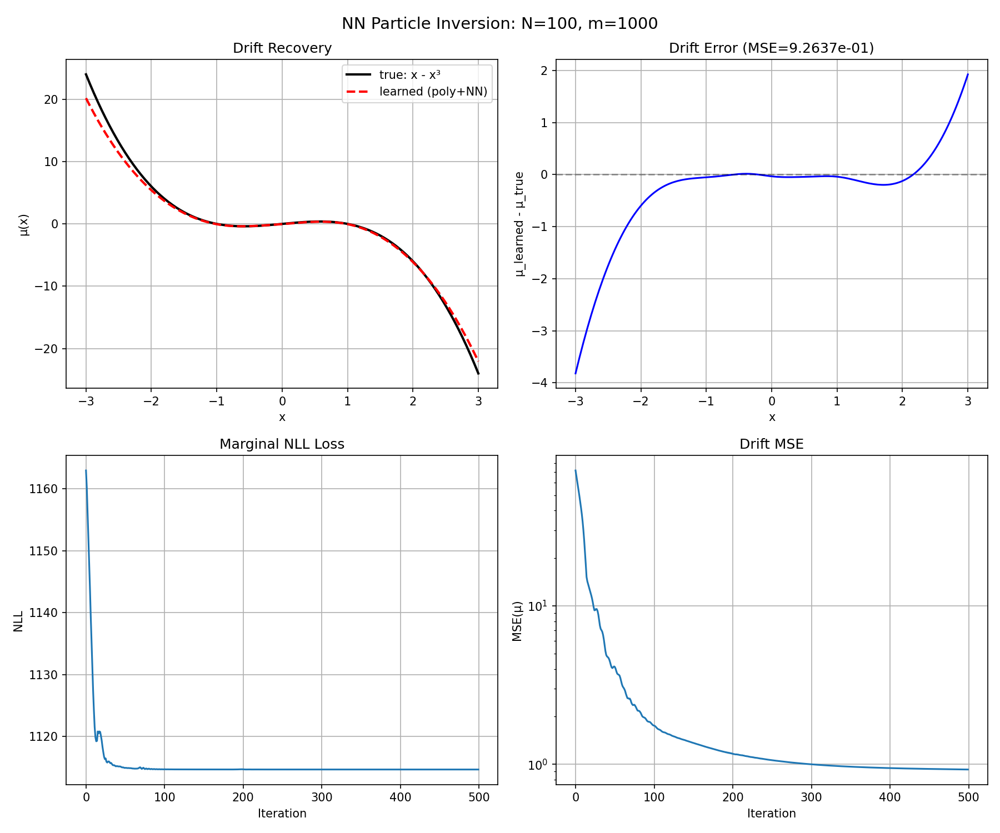
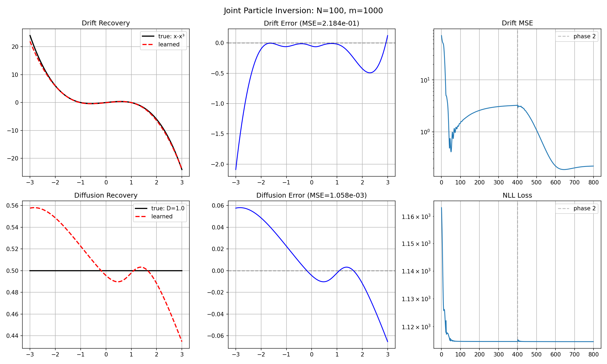
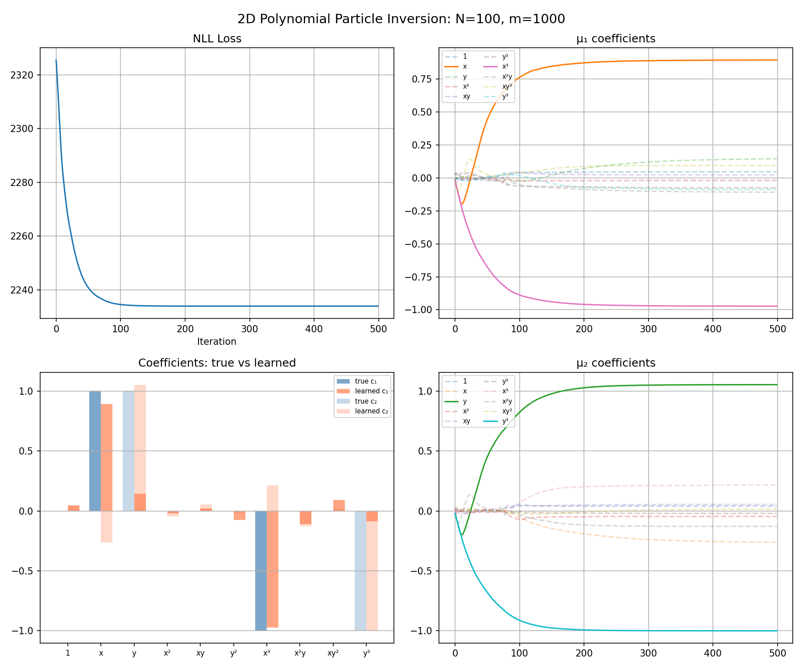

# Particle-Based Reconstruction

Reconstructing stochastic dynamics (drift and diffusion) from **time-unlabeled particle observations** via marginal likelihood optimization.

## Problem Setup

Instead of observing density snapshots directly, each observation consists of a **set of particles sampled at a single unknown time**:

$$t_i \overset{\text{i.i.d.}}{\sim} \text{Unif}(0,T), \quad X_{i,1},\dots,X_{i,m} \overset{\text{i.i.d.}}{\sim} \rho(\cdot,t_i)$$

The observed data is $Y_i = \{X_{i,1},\dots,X_{i,m}\}$ for $i=1,\dots,N$, but the time labels $t_i$ are **unknown**.

## Method

### Marginal Likelihood

Treat observation times as latent variables and integrate them out:

$$\mathcal{L}(\mu) = -\sum_{i=1}^N \log \left( \int_0^T \prod_{r=1}^m \rho_\mu(X_{i,r},t)\,\nu_t(dt) \right)$$

### Stable Implementation (log-sum-exp)

$$\mathcal{L}(\mu) = -\sum_{i=1}^N \text{LSE}_n \left( \log w_n + \sum_{r=1}^m \log \rho_\mu(X_{i,r},t_n) \right)$$

### Pipeline

1. **Forward solve:** Crank-Nicolson FPE solver computes $\rho_\mu(x,t_n)$ on time grid
2. **Interpolation:** Bilinear interpolation evaluates $\rho_\mu$ at particle positions
3. **Loss:** Log-sum-exp marginal likelihood
4. **Optimization:** Backpropagate through solver, update $\mu$ via Adam

## Results

### 1D

**Setup:** $\mu^*(x) = x - x^3$, $D=0.5$, $\Omega=[-3,3]$, $\rho_0 = \mathcal{N}(0, 0.25)$.

#### Polynomial Drift (2 parameters)

| m (particles/group) | $\theta_1$ | $\theta_2$ | Error |
|---|---|---|---|
| 10 | 0.882 | 0.824 | ~15% |
| 1000 | 0.963 | 0.974 | ~3% |


#### NN Drift Recovery (poly+NN)

Complete cubic polynomial + residual NN. Drift MSE = 0.93 in data-supported region.



#### Joint Drift + Diffusion (two-phase)

True: $D = 0.5$. Two-phase training with $N=100$, $m=1000$.

| | Drift MSE | D MSE |
|---|---|---|
| **Joint (poly+NN)** | **0.22** | **0.001** |



### 2D

**Setup:** $\mu^*(x,y) = (x-x^3, y-y^3)$, $D=0.5$, $\Omega=[-3,3]^2$.

#### Polynomial Drift (20 parameters)

Complete cubic basis. With $N=100$, $m=1000$: key coefficients ($x$, $x^3$, $y$, $y^3$) recovered at ~90% accuracy.



#### NN Drift Recovery

Drift MSE = 2.11. Good recovery in data-supported region $|x|,|y| < 2$.


#### Joint Drift + Diffusion

Short Phase 1 (50 iter warmup) + long Phase 2 (800 iter joint). $N=200$, $m=2000$.

| | Drift MSE | D MSE |
|---|---|---|
| Best (iter ~350) | **0.32** | **0.0001** |
| Final (iter 850) | 0.84 | 0.0025 |

Drift-diffusion compensation effect observed: both metrics degrade after optimal point. Early stopping recommended in practice.


### Effect of Particle Count $m$

- $m=1$: only recovers time-averaged density (severely ill-posed)
- $m \gg 1$: strong temporal signal, approaches density-based performance
- Particle observations trade statistical efficiency for practical applicability

## File Structure

```
particle/
├── problem_setup.md                # Detailed mathematical formulation
├── 1D/
│   ├── optimize_particle_1d.py     # 2-parameter polynomial inversion
│   ├── nn_particle_1d.py           # Poly+NN drift inversion
│   └── joint_particle_1d.py        # Joint drift+diffusion inversion
├── 2D/
│   └── particle_2d.py              # All 2D experiments (poly, NN, joint)
└── figures/
```
